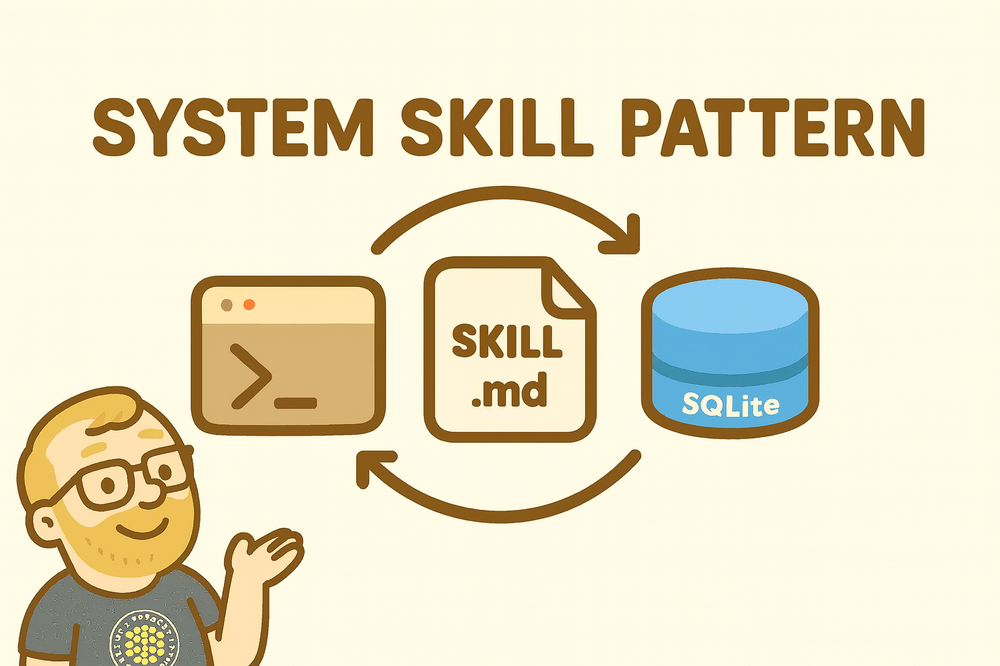

# Pomodoro - System Skill Reference Implementation



A working example of the [**System Skill Pattern**](https://www.shruggingface.com/blog/the-system-skill-pattern) -- an approach for building Claude Skills that persist state, learn from history, and provide increasingly useful insights over time.

**The Pattern:** CLI + SKILL.md + Database

Give Claude a command-line tool to run, instructions on how to operate a system, and a database to remember things. Watch it turn the crank, running its own OODA loop (Observe, Orient, Decide, Act) - building context that compounds across sessions.

This Pomodoro timer demonstrates the pattern in ~600 lines of code. It's deliberately simple so you can see how the pieces fit together, then build your own.

## Quick Install

```bash
# Add the marketplace (one-time setup)
/plugin marketplace add jakedahn/pomodoro

# Run the install script
~/.claude/plugins/marketplaces/pomodoro/install.sh
```

The Pomodoro skill will be installed to `~/.claude/skills/pomodoro/` and available immediately in Claude Code.

**Requirements:** macOS with Apple Silicon (arm64). For other platforms, see [Building From Source](#building-from-source).

## Usage

Once installed, just ask Claude to help with Pomodoros:

```
"Start a pomodoro for writing documentation"
"What did I work on today?"
"How productive was I this week?"
"What times do I work best?"
"Let's do flash cards, start 5 2min/1min pomodoro cycles"
```

Claude will use the Pomodoro skill to:

- Start 25-minute focus timers
- Track all your sessions
- Analyze productivity patterns
- Suggest optimal work times

## The System Skill Pattern

This implementation demonstrates three components working together to create a system that Claude can animate:

### 1. The CLI Binary

A standalone executable that provides handles for Claude to operate the system:

```bash
./pomodoro start --task "Deep work on authentication"
./pomodoro stats --period week
./pomodoro history --days 30
```

**Key attributes:**

- Self-contained (no runtime dependencies, no configuration)
- Helpful `--help` documentation for each command

The Pomodoro CLI provides five essential commands:

- `start` - Begin a 25-minute focus session
- `stop` - End current session early
- `status` - Check if timer is running
- `history` - View past sessions
- `stats` - Analyze productivity patterns

### 2. SKILL.md

The tutorial that teaches Claude how to think about and operate the system:

- What the system is and when to use it
- Which commands to run in different situations
- How to interpret output and look for patterns
- The mental model and decision flow

This is where you share the operating procedure. Claude uses this to run its OODA loop - observing sessions, orienting to patterns, deciding when to intervene, and acting by running CLI commands.

### 3. SQLite Database

Persistent storage that accumulates value over time. In this case, a simple schema:

```sql
CREATE TABLE sessions (
  id INTEGER PRIMARY KEY AUTOINCREMENT,
  task TEXT NOT NULL,
  duration INTEGER NOT NULL,
  started_at TEXT NOT NULL,
  completed_at TEXT
);
```

**Why SQLite:**

- Self-contained (just a file, co-located with the CLI)
- Zero configuration
- Easy to backup and restore
- Claude can query directly if needed

### Putting It All Together

You ask Claude to start a pomodoro. Claude reads `SKILL.md`, sees it should run `./pomodoro start`, executes the CLI. The CLI writes a row to SQLite. Session complete.

Three weeks later, you ask Claude about your productivity. It runs `./pomodoro stats --period week`, gets back JSON with all your sessions, and infers that you always finish morning sessions but abandon afternoon ones.

The magic is in the accumulation. Each session adds context. The system gets smarter over time.

## Technical Details

### Repository Structure

```
pomodoro-repo/               # Repository root
├── .claude-plugin/
│   ├── plugin.json          # Plugin manifest
│   └── marketplace.json     # Marketplace configuration
├── skills/
│   └── pomodoro/            # Pomodoro skill (automatically registered)
│       ├── SKILL.md         # Claude's instructions
│       ├── README.md        # Technical documentation
│       ├── bin/
│       │   └── pomodoro     # Compiled binary
│       └── scripts/         # Source code
│           ├── pomodoro.ts  # CLI interface (~290 lines)
│           ├── timer.ts     # Timer logic (~83 lines)
│           ├── db.ts        # Database operations (~171 lines)
│           └── build.sh     # Build script
└── README.md                # This file (repository docs)
```

### Building From Source

If you want to modify or rebuild:

```bash
./build.sh
```

**Requirements:**

- Deno 2.5 or later
- The build script compiles for your current platform

**About the build:**

- Uses `deno compile` to create a standalone binary
- Security permissions baked in at compile time:
  - No network access
  - No environment variable access
  - Can read and write to files on disk
- See [Deno's security model](https://docs.deno.com/runtime/fundamentals/security/) for details

## Building Your Own System Skill

This implementation is deliberately simple to serve as a reference:

- **~600 lines** of clean, readable code
- **Single table** database schema
- **Zero dependencies** runtime
- **Complete source** included

Browse the code to see how it works, then build your own:

**Personal Finance Manager**

- CLI: `money tx list`, `money note abc-123 "unexpected road trip!"`, `money cat abc-123 "vacation"`
- Database: Table of bank/credit card transactions
- Result: Claude watches for spending trends and asks about anomalies

**Personal Project Management**

- CLI: `task new "rake the leaves"`, `task update T-123 --status=done`, `task kanban`
- Database: Tasks with status, due date, priority
- Result: "What are my top 3 priorities for the week?"

**Gratitude Journal**

- CLI: `thankful "for my cat"`, `thankful trends`, `thankful search`
- Database: Entries with message and timestamp
- Result: A journal that talks back and lifts you up

**ChatGPT Pulse Clone**

- CLI: `pulse topic add "AI safety research"`, `pulse generate`, `pulse feedback <id> --helpful`
- Database: Topics you care about, generated briefings, feedback
- Result: Morning briefing that learns what's useful to you

**Note Taker with Memory**

- CLI: `note add "API design thoughts"`, `note search "authentication"`, `note tag T-123 "urgent"`
- Database: Notes with tags and full-text search
- Result: Claude can recall and connect ideas across sessions

Each one follows the same pattern: Give Claude handles to operate a system via a CLI, and watch it turn the crank.

## Why This Matters

Most Claude Skills are stateless - they run and forget. The System Skill Pattern shows how adding simple persistence enables something different:

- **Memory**: Every interaction saved, building context over time
- **Learning**: Patterns emerge from accumulated data
- **Compounding value**: The tool gets more useful with use
- **Autonomy**: Claude animates the system rather than just responding to it

When you give Claude the handles to operate a system - a CLI to run commands, a database to remember things, and a tutorial on how it all works - something shifts. It's not just running commands anymore. It's turning the crank. Running its own OODA loop. Building context that compounds over time.

That's the phase change: chat agents and Skills joining to become something new - systems that Claude animates rather than just responds to.

## License

MIT

## Author

Jake Dahn - [shruggingface.com](https://shruggingface.com)
